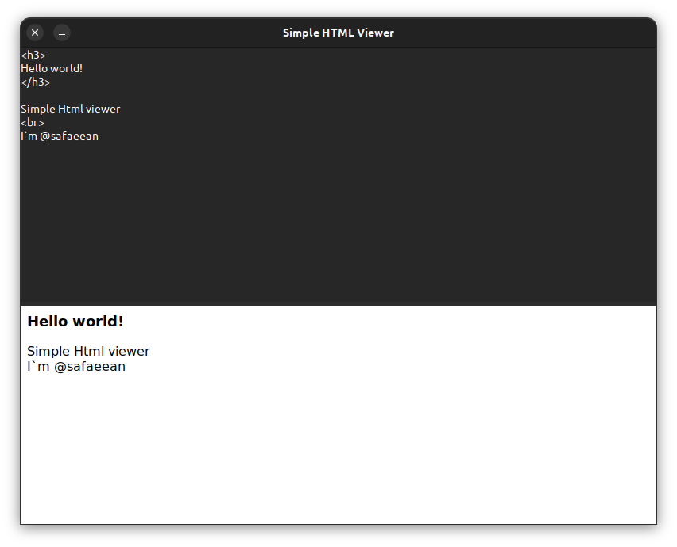

# Simple HTML Viewer App

This project is a simple HTML viewer application built using the GTK graphical user interface.

## Installation and Usage

1. First, use Git to clone the project:
    ```bash
    git clone https://github.com/safaeeansimple-html-viewer.git
    cd simple-html-viewer
    ```
2.  Now, you can run the project:
    ```bash 
    python app.py
    ```

## Screenshots



## How to Use
1. When the application is launched, a window with a textarea and a WebView will be displayed.
2. You can enter your desired HTML code in the textarea.
3. Changes in the textarea are automatically displayed in the WebView.

## Editing the Code
If you wish to edit this project, you can open the app.py file and apply your changes. Additionally, you can customize the appearance and behavior of the project by modifying the `HTMLViewer` class.

## Requirements
To run this project, you need the following libraries:

1. gi
2. WebKit2

You can install these libraries using the following command:

```bash
pip install PyGObject
```

## Issues and Support
If you encounter any issues with running or using the project, please feel free to contact me.
